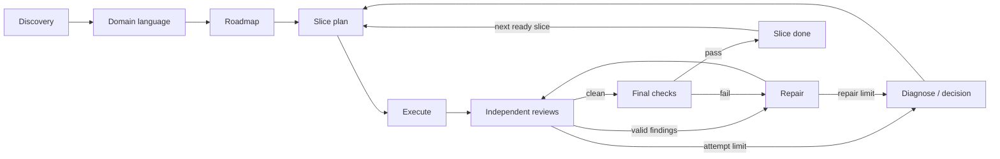

# Agentic Workflow

One plugin for Codex and Claude Code. Shared skills guide product discovery,
DDD ubiquitous language, vertical-slice planning, implementation, independent
review, and resumption. A small Python helper records execution graph state and
queries an optional project knowledge graph.

No model API keys, pip dependencies, background hooks, or graph server required.
The coding host executes the agents; this plugin supplies skills, routes and
evidence checks. It does not run an unattended scheduler by itself.

## Install locally

The repository is the marketplace; the plugin is `plugins/agentic-workflow`.
These commands are installation instructions, not actions performed by cloning it.

### Codex

```sh
codex plugin marketplace add ~/work/agentic-workflow
codex plugin add agentic-workflow@personal
```

The repository's Codex marketplace is named `personal`, following the scaffold
default. It is distinct from an implicitly discovered home-directory marketplace.
If you already have another marketplace named `personal`, resolve that naming
collision before registering this one. Open a new task after installation and
select an `aw-*` skill from the skill picker (or invoke `$aw-discover`).

### Claude Code

For a session-local trial without permanent installation:

```sh
claude --plugin-dir ~/work/agentic-workflow/plugins/agentic-workflow
```

Or install from the local marketplace:

```sh
claude plugin marketplace add ~/work/agentic-workflow
claude plugin install agentic-workflow@agentic-workflow
```

Start a new session and invoke `/agentic-workflow:aw-discover`.

### Install focused agents and compaction policy

After plugin installation, run once (also works from the plugin cache):

```sh
python3 ~/work/agentic-workflow/plugins/agentic-workflow/scripts/setup_agents.py \
  --codex-home ~/.codex --claude-settings ~/.claude/settings.json
```

This installs five native Codex profiles and merges Claude's 200,000-token
compaction window into settings. Isolated Codex workers use a 200,000-token
compaction trigger; native roles inherit the parent's threshold. Setup preserves unrelated settings, backs up changed
Claude settings and refuses conflicting agent files. Merge customized profiles
manually when upgrading. For project-only setup, use `--codex-home /project/.codex`
and `--claude-settings /project/.claude/settings.json`. Either flag works alone.
Restart both clients after setup; existing sessions keep their loaded configuration.

Claude discovers the five profiles directly from the plugin. Codex uses its
native agents directory; installing the skills alone does not install profiles.
Neither client needs separate Caveman/Ponytail plugins in each child: every profile
embeds the core behavior. Workers consume a small Mem0-derived packet supplied by
the coordinator instead of loading full plugin libraries or repeating recall.

| Worker | Codex | Claude | Work |
| --- | --- | --- | --- |
| `aw-scout` | Luna / low | Haiku / low | Locate files, symbols and callers |
| `aw-researcher` | Terra / medium | Sonnet / medium | Verify scoped facts |
| `aw-builder` | Terra / medium | Sonnet / medium | Implement and test a bounded contract |
| `aw-refuter` | Sol / high | Opus / high | Independently inspect and rerun checks |
| `aw-debugger` | Sol / high | Opus / high | Diagnose hard root causes |

The coordinator keeps your chosen model. Two workers maximum by default; exact
file ownership, fresh contexts, compact briefs/reports, no recursive delegation.
Tiny work stays local. Builders build; refuters verify without source edits.
See [delegation policy](plugins/agentic-workflow/references/subagents.md) for exact
model IDs, budgets, escalation, handoffs and portable worker instructions.

**Claude limitation:** `CLAUDE_CODE_AUTO_COMPACT_WINDOW=200000` applies to the main
session **and all subagents**, with default compaction around 190k tokens. There
is no supported per-subagent environment setting. It does not make small models
support larger contexts or guarantee a hard token ceiling. Setup refuses known
settings-file compaction conflicts; shell/managed overrides still need checking.
For a session-only trial without changing settings:

```sh
CLAUDE_CODE_AUTO_COMPACT_WINDOW=200000 claude \
  --plugin-dir ~/work/agentic-workflow/plugins/agentic-workflow
```

## Use it

Run skills inside the project you want to develop. Start with a description:

> Use aw-discover. I want to build an app that helps small teams reserve shared
> equipment. Act as a Product Engineer and Principal Software Engineer and ask
> one guided question at a time.

After discovery:

> Use aw-domain to establish our ubiquitous language and business invariants from
> the PRD, then aw-roadmap to organize milestones into vertical tracer bullets.

For a defined slice:

> Use aw-plan for M1.T1 using the current roadmap and domain language. Include
> important contract snippets and the required verification commands.

For authorized implementation:

> Use aw-resume to coordinate M1.T1 through implementation, independent specialist
> and real Claude review, valid finding repairs and final checks. Save resumable
> state. Stop for a material decision or review escalation.

| Skill | Responsibility |
| --- | --- |
| `aw-discover` | Guided discovery and one accepted PRD |
| `aw-domain` | DDD terms, examples, invariants, lifecycles and context boundaries |
| `aw-roadmap` | Milestones, vertical slices, dependencies and acceptance |
| `aw-plan` | One concrete next-slice plan grounded in code |
| `aw-execute` | Focused implementation/repair and meaningful checks |
| `aw-review` | Independent review, adjudication, scoped rereview and final verification |
| `aw-resume` | Coordinate graph steps or resume from exact local run state |
| `aw-context` | Retrieve scoped Mem0 facts and prepare compact worker context |

Each skill works independently. A request to plan does not start implementation.
The full graph is useful for multi-stage work and cross-client handoffs.

## The two graphs



The **orchestration graph** records current work, role, allowed outcomes and
evidence. The default review node joins a specialist result and cross-model
result, which the host may run concurrently on the same frozen snapshot.

The **knowledge graph** links concepts and artifacts, for example:
`slice → implements → requirement → uses_term → domain term`.
It supports bounded context retrieval and impact exploration. It does not route
agents or prove that a test passed. Domain terms feed every subsequent stage;
DDD is not an instruction to introduce microservices or tactical patterns.

See [research and alternatives](docs/research.md) for LangGraph, Agent Graph,
GraphRAG and the reason this version uses simple local files.

## Start/resume a graph run

Python 3.10+, Git, macOS/Linux. Initialize Git in a new project first. From any
directory, point the helper at the project explicitly:

```sh
python3 ~/work/agentic-workflow/plugins/agentic-workflow/scripts/workflow.py \
  --project /path/to/project init equipment-m1 --slice M1.T1

python3 ~/work/agentic-workflow/plugins/agentic-workflow/scripts/workflow.py \
  --project /path/to/project status equipment-m1
```

Then ask either client to use `aw-resume` for `equipment-m1` in that worktree.
It reads the returned route, performs the work, and records actual evidence.
Existing accepted documents can satisfy discovery/domain/roadmap after inspection;
they do not need to be recreated. State resides in the Git common directory under
`agentic-workflow/`, shared between clients on this machine. Keep the worktree.

See [runtime/evidence format](plugins/agentic-workflow/references/runtime.md) for
advance, note, recover, custom graphs, review joins and verification evidence.
The helper checks allowed transitions, stale revisions, fingerprints, required
reviewers, unresolved dispositions and planned check coverage. It does not prove
that agent-supplied evidence is truthful or restore lost working files/processes.

Two repair rounds are the default. Failed reviewer attempts are also bounded.
Exhaustion routes to diagnosis; it never means “clean enough.” Native agents and
real cross-model CLI access must be available to satisfy independent review.

## Project knowledge and shared recall

Reuse your existing document paths. New projects default to `docs/product/PRD.md`,
`docs/domain/DOMAIN.md`, `docs/roadmap/ROADMAP.md` and `docs/plans/<slice>.md`.
Put project-specific conventions, required checks and role choices in
`docs/workflow/project.md` only when needed.

Use `aw-context` to create `docs/workflow/knowledge.json` from actual artifacts.
Its [format and query examples](plugins/agentic-workflow/references/knowledge.md)
use stable IDs, typed edges and provenance. No automatic extraction or embeddings.
Queries are bounded neighborhoods, not exhaustive review coverage.

Mem0 is the exclusive shared-memory provider. The coordinator searches once per
slice/meaningful context change and verifies essential writes at boundaries.
Workers receive relevant memories in their packet; they do not access Obsidian or
another memory backend. Canonical docs and exact run state stay in the repository.
An unavailable Mem0 connection is reported; authorized work can proceed from
explicit artifacts without pretending that recall or persistence succeeded.

See [Mem0 and minimal workers](plugins/agentic-workflow/references/memory.md) for
scope, write verification and isolation. Use `scripts/run_worker.py --help` for the
isolated process path. Native Claude profiles restrict tools but cannot disable
session plugin hooks; native Codex roles cannot selectively remove inherited MCP.
Strict workers therefore use a separate CLI process with role instructions and a
Mem0 packet. Authentication stays with the installed client; no API billing switch.

## Extend and validate

- Add a focused `skills/<name>/SKILL.md`; both clients load the same source.
- For a project route, copy the default graph, add a node/edges and pass `--graph`.
- Add reviewer IDs to `required_reviewers` and document how the host supplies them.
- Add domain-specific graph relations only when an actual question needs them.

Keep host-specific manifests separate. Do not copy the skills for each client or
add a general agent scheduler until this fixed workflow demonstrably needs one.
Keep native agent instructions aligned across `agents/` and `codex-agents/`.

```sh
python3 -m unittest discover -s tests -v
claude plugin validate plugins/agentic-workflow
claude plugin validate .claude-plugin/marketplace.json
```

Tests use disposable Git repositories and no model calls. They cover full graph
progress, process restarts, stale writers/evidence, incomplete review, repair caps,
working files and dependency graph boundaries. Codex's bundled plugin/skill
validators were also run during creation. Live model workflow quality and token
savings still need a real-slice pilot.
